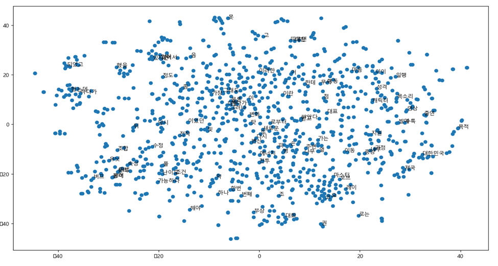
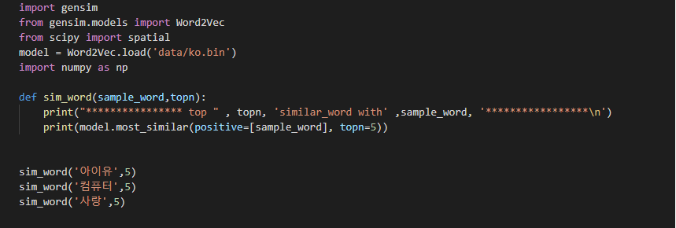

# korean2vec
Applying Word2Vec to Korean

# Dataset
kowiki-20190220-pages-articles-multistream.xml
 
-500000 vocab_size
 
-5 window size
 
-100 vector size
 
# Result

# visualize (samples only)

# Test

